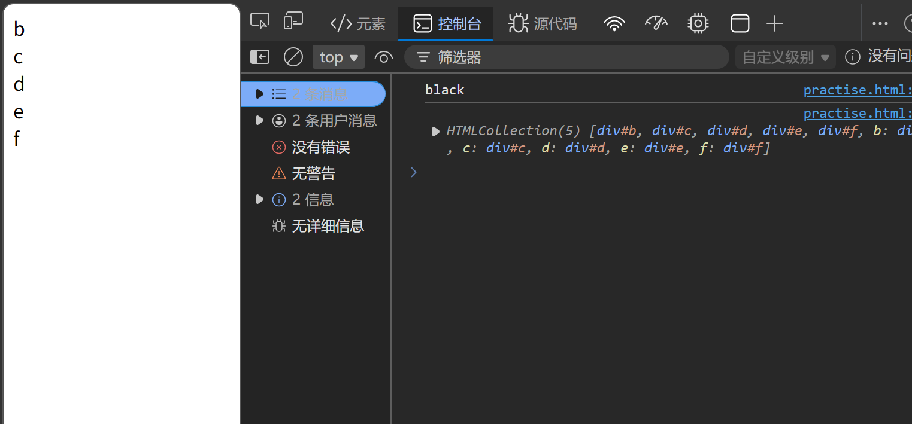

# 查找DOM节点
### 格式
```JavaScript
子元素.parentNode; //返回最近一个父节点元素
父元素.children;  //返回所有子节点元素组成的伪数组
```
### 代码示例
```JavaScript
<div id="A" style="color: black">
    <div id="b">b</div>
    <div id="c">c</div>
    <div id="d">d</div>
    <div id="e">e</div>
    <div id="f">f</div>
</div>
<script>
    const a = document.querySelector('#A')
    const b = document.querySelector("#b")
    console.log(b.parentNode.style.color)
    console.log(a.children)
</script>
```
### 运行效果

