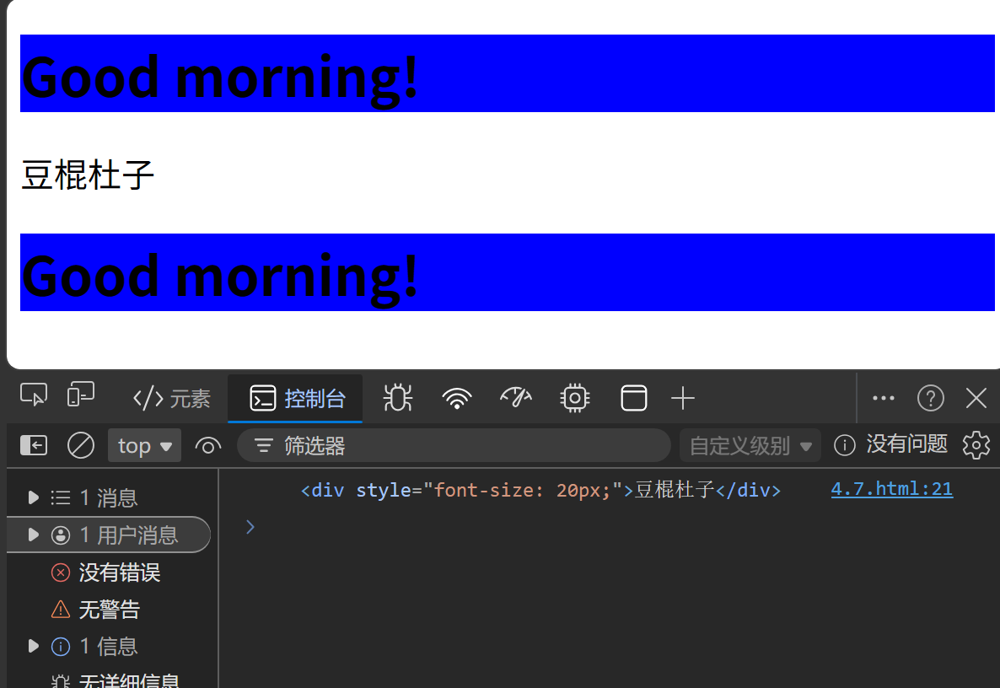
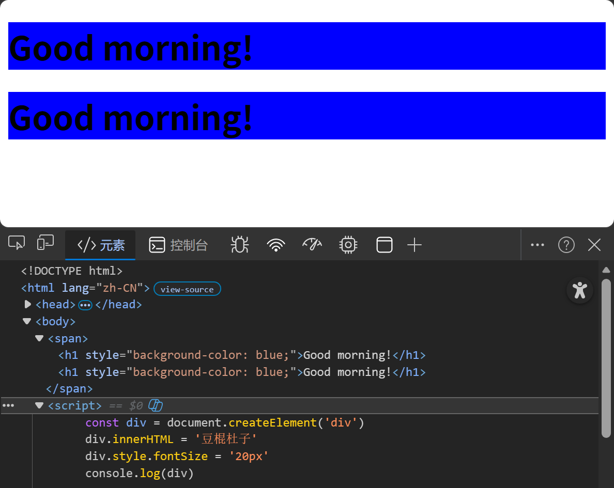

# 克隆和删除节点
## 克隆节点
```javascript
    const h1_Clone = h1.cloneNode(true) //false:只clone元素和属性，不clone innerHTML(默认)
    // true:完全克隆，包括inn二HTML及所有子节点
    span.appendChild(h1_Clone) 
```


## 删除节点
原生js中必须通过父元素删除某节点
```javascript
span.removeChild(div)
```
